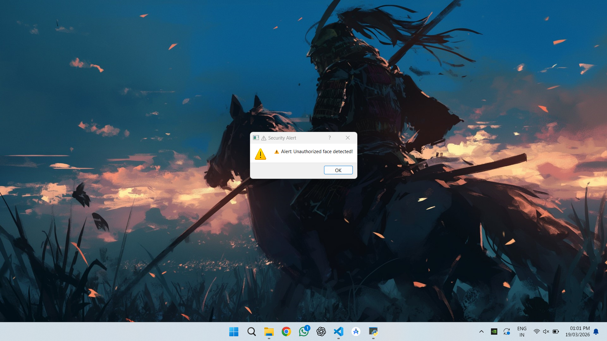
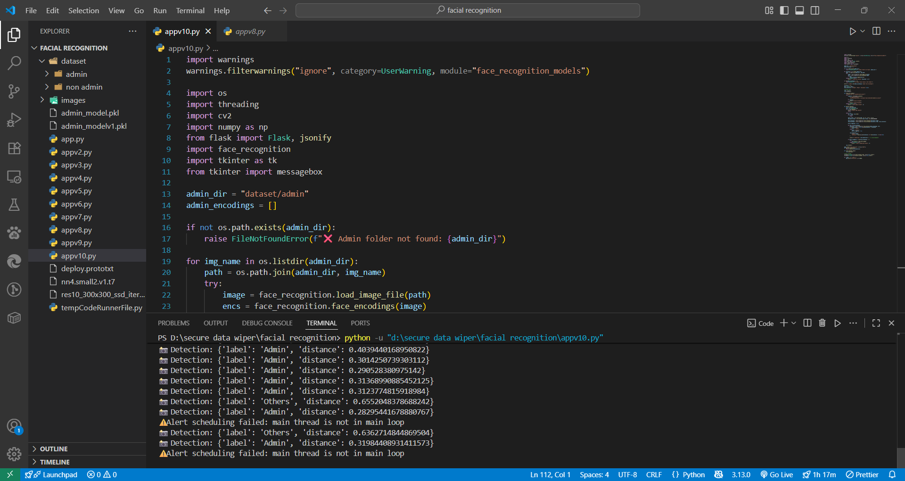

# Crypto Eye - Version 5

**Crypto Eye** is a **Python-based facial recognition security application** designed to protect your workspace privacy in real time. If an unauthorized person is detected viewing the screen while the admin is working, the app instantly **locks the screen** and displays a **security alert message**.

- **Real-time detection of unauthorized access:** Continuously monitors your screen environment and instantly identifies unfamiliar faces.  
- **Automatic prevention of data breaches:** Locks the screen immediately when an intruder is detected, ensuring sensitive information stays secure.  
- **Instant alerts for admins:** Notifies the user in real time about potential security breaches, allowing immediate action.  
- **Comprehensive alert logging:** Maintains logs of all unauthorized access attempts for audits and security analysis.  
- **Proactive security approach:** Shifts from reactive security to active problem-solving, reducing the risk of accidental or intentional data exposure.  

## 🚀 Features

- **Real-time facial recognition** using your webcam  
- **Instant screen lock** when unauthorized access is detected  
- **Security alert notifications** to keep the admin informed  
- **Lightweight & user-friendly interface**


## 🛠 Tech Stack

- **Languages & Frameworks:** Python, Flask, PyQt5  
- **Libraries & Tools:** OpenCV (`cv2`), `face-recognition`, `os` module  
- **Functionality:** Real-time monitoring, facial recognition, automatic screen locking  


## 📸 Screenshots / Demo

<div style="display:flex; gap:20px; flex-wrap: wrap;">

<div style="text-align:center; flex:1">
  
  <p><strong>Security Alert Message</strong></p>
</div>

<div style="text-align:center; flex:1">
  
  <p><strong>Alert Log Overview</strong></p>
</div>

<div style="text-align:center; flex:1">
  
  <p><strong>Unauthorized Person Detected #1</strong></p>
</div>

<div style="text-align:center; flex:1">
  
  <p><strong>Unauthorized Person Detected #2</strong></p>
</div>

</div>

## Installation

1. Clone the repository:
```bash
git clone https://github.com/yourusername/crypto-eye.git
cd crypto-eye
```

2. Create a virtual environment and activate it:
```bash
python -m venv venv
# Windows
venv\Scripts\activate
# Linux / macOS
source venv/bin/activate
```

3. Install dependencies:
```bash
pip install -r requirements.txt
```

4. Run the application:
```bash
python crypto_eye.py
```
